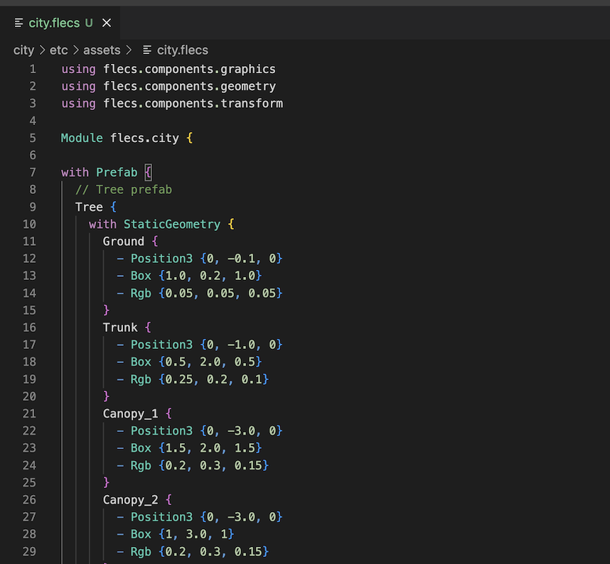

# flecs-lang
This extension adds syntax highlighting to vscode for files with the `.flecs` extension. Files with this extension contain [flecs](https://github.com/SanderMertens/flecs) entity descriptions, which can be used to load things like configuration, assets and scene graphs into flecs apps. Flecs is an entity component system for C/C++.

## Screenshot

## Resources
- [Flecs repository](https://github.com/SanderMertens/flecs)
- [Examples](https://github.com/SanderMertens/flecs/tree/master/examples/plecs)
- [Online editor](https://flecs.dev/explorer)

## Release Notes

## v1.0.0

- Initial release

## v1.0.1

- Fixed issue with member syntax being applied to entities.
- Updated README

## v1.0.2

- Add const keyword
